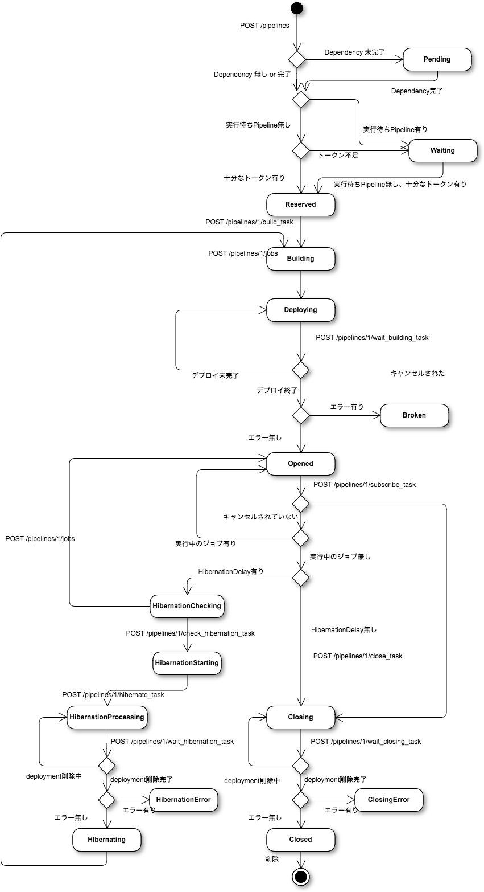

# Pipeline state transition

## State Transition Diagram

## State Transition Table

| No. | Request path                                                  |  (Start) | Uninitialized | Broken | Pending  | Waiting  | Reserved | Building  | Deploying | Opened              | HibernationChecking   | HibernationStarting   | HibernationProcessing | HibernationError | Hibernating | Closing  | ClosingError | Closed |
|----:|---------------------------------------------------------------|:--------:|:-------------:|:------:|:--------:|:--------:|:--------:|:---------:|:---------:|:-------------------:|:---------------------:|:---------------------:|:---------------------:|:----------------:|:-----------:|:--------:|:------------:|:------:|
|  1  | POST /pipelines/                                              | Pending/Waiting/Reserved | -      |  - | -   |     -    |     -    |    -      |    -      |    -                | N/A                   |   N/A                 | N/A                   | N/A              | N/A         | N/A      | N/A          | N/A    |
|  2  | (Dependency DONE)                                             |  -       | N/A           | N/A    | Waiting/Reserved | N/A | N/A   | N/A       | N/A       | N/A                 | N/A                   |   N/A                 | N/A                   | N/A              | N/A         | N/A      | N/A          | N/A    |
|  3  | (Dependency DONE)                                             |  -       | N/A           | N/A    | N/A      | Reserved | N/A      | N/A       | N/A       | N/A                 | N/A                   |   N/A                 | N/A                   | N/A              | N/A         | N/A      | N/A          | N/A    |
|  4  | POST /pipelines/:id/build_task                                |  -       | N/A           | N/A    | N/A      | N/A      | Building->Deploying  | N/A | N/A | N/A                 | N/A                   |   N/A                 | N/A                   | N/A              | N/A         | N/A      | N/A          | N/A    |
|  5  | POST /pipelines/:id/wait_building_task                        |  -       | N/A           | N/A    | N/A      | N/A      | N/A      | N/A       | Opened    | N/A                 | N/A                   |   N/A                 | N/A                   | N/A              | N/A         | N/A      | N/A          | N/A    |
|  6  | POST /pipelines/:id/cancel                                    |  -       | Closed        | N/A    | Closed   | Closed   | Closed   | -         | -         | -                   | N/A                   |   N/A                 | N/A                   | N/A              | N/A         | N/A      | N/A          | N/A    |
|  7  | POST /pipelines/:id/cancel                                    | -        | N/A           | N/A    | N/A      | N/A      | N/A      | N/A       | N/A       | -                   | -                     | -                     | -                     | -                | Closed      | -        | -            | -      |
|  8  | POST /pipelines/:id/subscribe_task (NOT DONE)                 | -        | N/A           | N/A    | N/A      | N/A      | N/A      | N/A       | N/A       | -                   | N/A                   |   N/A                 | N/A                   | N/A              | N/A         | N/A      | N/A          | N/A    |
|  9  | POST /pipelines/:id/subscribe_task (DONE with hibernation)    | -        | N/A           | N/A    | N/A      | N/A      | N/A      | N/A       | N/A       | HibernationChecking | N/A                   |   N/A                 | N/A                   | N/A              | N/A         | N/A      | N/A          | N/A    |
| 10  | POST /pipelines/:id/subscribe_task (DONE without hibernation) | -        | N/A           | N/A    | N/A      | N/A      | N/A      | N/A       | N/A       | Closing             | N/A                   |   N/A                 | N/A                   | N/A              | N/A         | N/A      | N/A          | N/A    |
| 11  | POST /pipelines/:id/wait_closing_task (NOT DONE)              | -        | N/A           | N/A    | N/A      | N/A      | N/A      | N/A       | N/A       | N/A                 | N/A                   |   N/A                 | N/A                   | N/A              | N/A         | -        | N/A          | N/A    |
| 12  | POST /pipelines/:id/wait_closing_task (ERROR)                 | -        | N/A           | N/A    | N/A      | N/A      | N/A      | N/A       | N/A       | N/A                 | N/A                   |   N/A                 | N/A                   | N/A              | N/A         | ClosingError  | N/A     | N/A    |
| 13  | POST /pipelines/:id/wait_closing_task (DONE)                  | -        | N/A           | N/A    | N/A      | N/A      | N/A      | N/A       | N/A       | N/A                 | N/A                   |   N/A                 | N/A                   | N/A              | N/A         | Closed   | N/A          | N/A    |
| 14  | POST /pipelines/:id/check_hibernation_task (HAS NEW JOB)      | -        | N/A           | N/A    | N/A      | N/A      | N/A      | N/A       | N/A       | N/A                 | -                     |   N/A                 | N/A                   | N/A              | N/A         | N/A      | N/A          | N/A    |
| 15  | POST /pipelines/:id/check_hibernation_task (NO NEW JOB)       | -        | N/A           | N/A    | N/A      | N/A      | N/A      | N/A       | N/A       | N/A                 | HibernationStarting   |   N/A                 | N/A                   | N/A              | N/A         | N/A      | N/A          | N/A    |
| 16  | POST /pipelines/:id/hibernate_task                            | -        | N/A           | N/A    | N/A      | N/A      | N/A      | N/A       | N/A       | N/A                 | N/A                   | HibernationProcessing | N/A                   | N/A              | N/A         | N/A      | N/A          | N/A    |
| 17  | POST /pipelines/:id/wait_hibernation_task (NOT DONE)          | -        | N/A           | N/A    | N/A      | N/A      | N/A      | N/A       | N/A       | N/A                 | N/A                   |   N/A                 | -                     | N/A              | N/A         | N/A      | N/A          | N/A    |
| 18  | POST /pipelines/:id/wait_hibernation_task (ERROR)             | -        | N/A           | N/A    | N/A      | N/A      | N/A      | N/A       | N/A       | N/A                 | N/A                   |   N/A                 | HibernationError      | N/A              | N/A         | N/A      | N/A          | N/A    |
| 19  | POST /pipelines/:id/wait_hibernation_task (DONE)              | -        | N/A           | N/A    | N/A      | N/A      | N/A      | N/A       | N/A       | N/A                 | N/A                   |   N/A                 | Hibernating           | N/A              | N/A         | N/A      | N/A          | N/A    |
| 20  | POST /pipelines/:id/jobs                                      | -        | -             | -      | -        | -        | -        | -         | -         | -                   | Opened                |   -                   | -                     | -                | Reserved    | -        | -            | -      |
